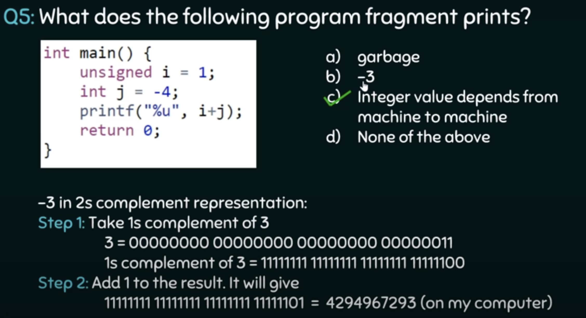
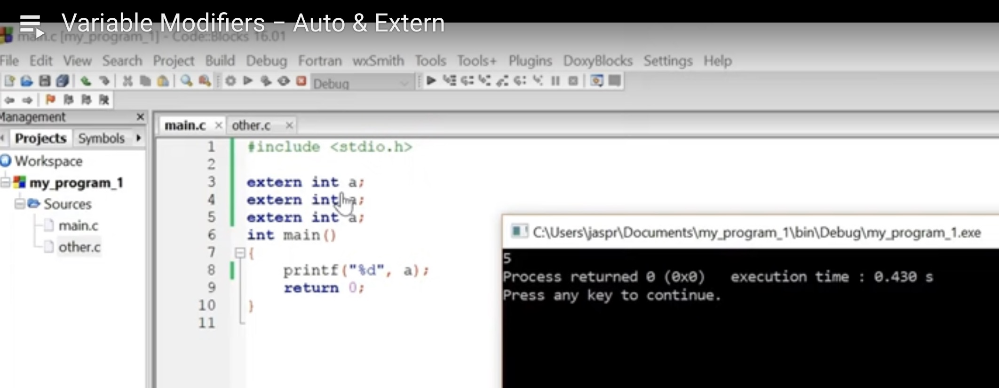
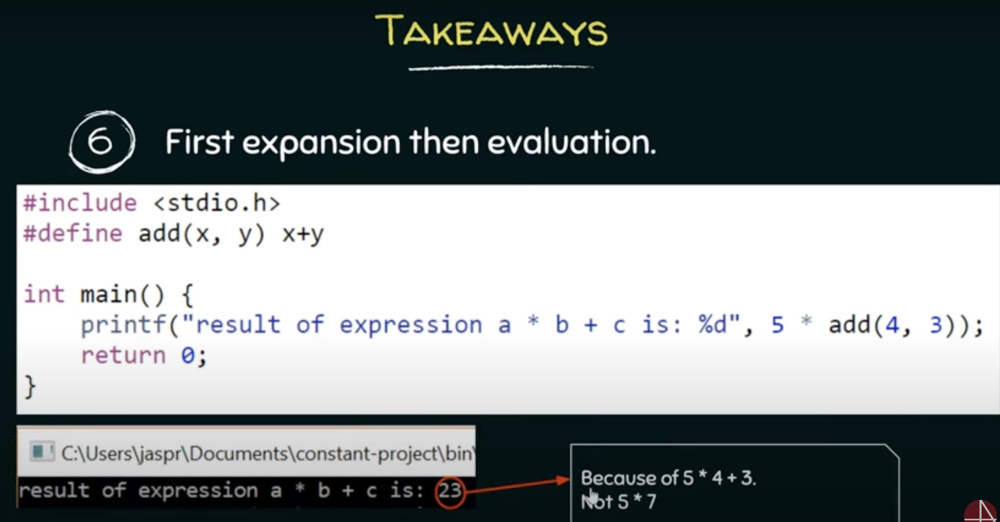
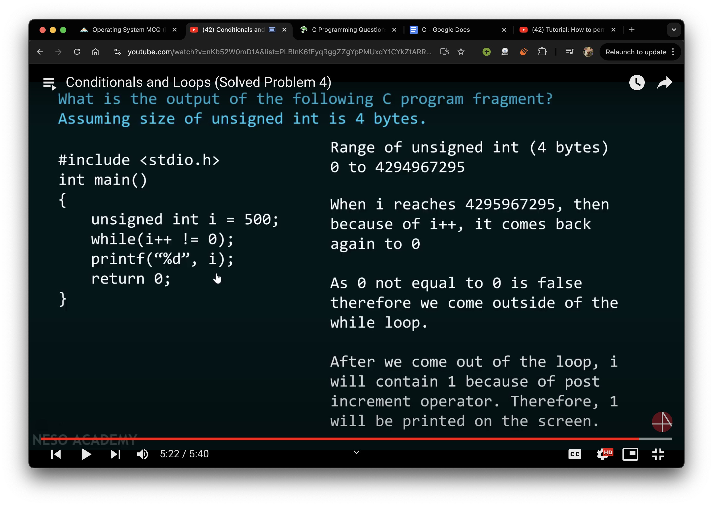

# 🚦 Playlist phase 1 (reaching till functions), 0->25% Playlist
## DATA TYPES
### numeric

if you subtract 1 from int_min you will revert back to int_max and vice versa

 because on his comp size of int is 4 bytes, 1byte = 8bits, it gave **4294967295(INT_MAX for 4bit)**-2  = 4294967293,  
printed w/ %u, code will render the int acc to the size of int set on machine as shown in his output;  
howver if we did %d then it would render the true value of the arithmetic operation that is -3.

 put a 0 next to a number and the compiler interprets it as an octal!!. use 0x and it becomes hex!! but if instead of %d you use %o(similarly %x for hex) you get:

  
    
if using int var = 0x43FF; printf("%x", var); youll get 43ff  
but with printf("%X", var); youll get 43FF.

### char
 char you can either initliase by giving 'a' or by its ascii val
size of char is 8bit and range is from:  
    unsigned = 0 to 255
    signed = -128 to 127

 signed me last bit is treated as negative only, usse pehle ki saari bits positive hoti hai. -128+1 -127 dega. thats how we represent -ve in signed.  
-1 will be rep in 8 bits as 1 1 1 1 1 1 1 1. 

acha and -128 == +128 as they are on the same position on the clock.  

in trad ascii table, char  = 7bits. in mdoern = 8 bits

 printf function not only prints in terminal but also returns no of chars it successfully printed. %d is caputing that.  
**output: Hello World!12**

 %10s means 10 length ka window print karega. Hello sirf 5 letterska hai to fir start me 5 blank spaces apni taraf se jodd dega.

### float

 float is precise to 8-1=7 decimals, double (rep by *l*) till 15 decimals and long double (rep by *L*) by 19 decimals. Do check how the are called while printing. 

## SCOPE

 redefinition error occurs when reinit in the same block

## MODIFIERS

### auto and extern
 

 doing this is perfectly fine as you are just redeclaring it multiple times. extern isnt letting you redefine it which doesnt throw redefinition error. 
  
extern says go out of my scope and check is var is defined. if yes, call it. else you can define also by saying extern int a = 1234.

### register

 to store var in reg. fastest access. not reqd as compiler does necessary optimisations.

### static

when a global var is declared, it is accesible by all files in a directory.
if some other file wants to use it it can do so by using the extern int var command.  
but if while def the global var you put a static before it, the global var becomes to that and only that file only and other files in the dir wont be able to call it.

 oh btw, just like declaring a global var automatically assigns it to 0 and not a garbage value *(not the case with inside a function. agar tu int a; karega then printf(%d, a) then garbage value throw kardega)*, declaring a var inside a function like static int a also assigns it to 0 and not garbage.

 static int can ONLY be init by a const, not a var.

#### memory storage of var while init (example: static var)
[watch this video i cant explain it](https://www.youtube.com/watch?v=gegaS_gX3TY&list=PLBlnK6fEyqRggZZgYpPMUxdY1CYkZtARR&index=19)

 assignment/redefinition(dont confuse with definition) of a global variable is only allowed within function scope not global scope (like done in line 6 above).

## define and const

 pehle preprocesser replace karta hai code ko apni jagah par, then evaluation hota hai. this is important!! 

## INPUT BY SCANF

 dont forget to pass the var by address inside scanf! scan takes input data type and address of storage.

## OPERATORS

   notice that we have predefined the lexemes for the lexical analyser by preinserting the spaces 

  

 

 

## LOOPS AND CONDS
 **output: 16 21**  
 as there are no breaks, when i=0; it will match with case 0 then with case 1 then with case 5 then with case then with default then 16 will get printed. then 16 will go to for loop and get ++ed to 17 and as 17<20, it will enter switch and hit the default case and become 21 which will get printed. 21 will get ++ed to 22 and as 22>20 program will end.

### Vid 47->59, are solved uni exam problems. look at them when you have time or if you want to. skip ahead to functions

# CONGRATULATIONS!!!!!!!!!!! 😺🍻 25% MARK CROSSED 
*in fact you crossed the 35% mark after skipping [47,59]*

# 🚦 Playlist phase 2 (reaching till pointers), 25->50% Playlist

## FUNCTIONS

   
