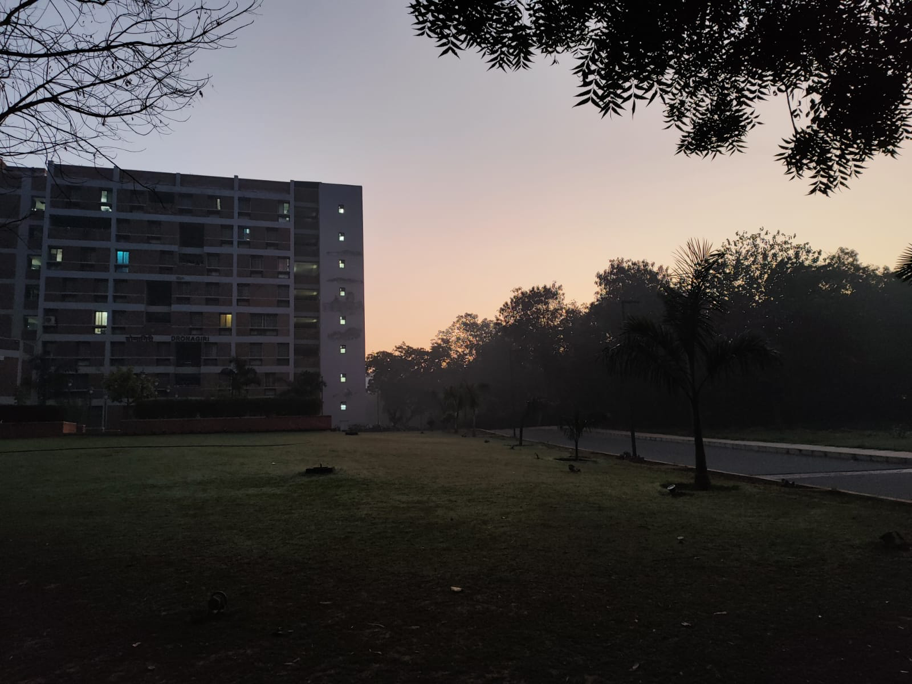
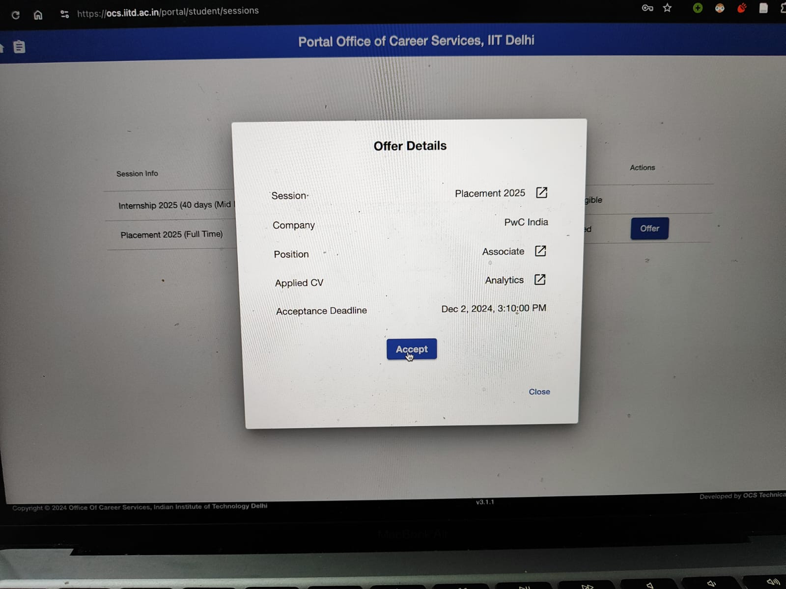

# I Got Placed 😺

I finally got placed on Day 10(10/12/24)! Here's my [Selections & Rejections](https://drive.google.com/file/d/1Sgo4qGESqrIRDl0oDYtE3oLrLWoJOhcv/view?usp=sharing).  
It has been excruciating trying to survive till day 10. Here's a brief rundown of whatever happened with me.

### Day -120 to Day -30

I have a great Deep Learning CV, am from EE and my locked CGPA is 7.41. With enough coding, I thought I could easily clear many tech companies and especially Deep Learning roles. I start practicing Leetcode(not doing blind practice would become the reason for my downfall later on) and hope for the best as time goes on.

### Day -30 (Close to Diwali)

Was performing badly in my coding OAs as the way I was practicing coding questions was very wrong (ideally one should do CP and then brush up Leetcode). Diwali break comes around and I start studying Digital Electronics, Computer Architecture and C programming. Clearing OAs of core companies like Texas Instruments, Qualcomm etc. was the only thing in my mind now, as I had accepted I can't crack a SDE/SWE job.  
Diwali break ends and my scedule start taking pace. I gave a lot of core OAs in this period. However, to my dismay, people who chose the Embedded+Software profile in Texas Instruments were shorlisted only if they a 8>= CGPA. Other than that, people with 6.5>= CGPA were shortlisted in Analog and Digital roles.   
Many cheated, using screen share on Macs, and got shortlisted for Digital and Analog roles with 6.9 CGPAs. I was completely devastated that the company I left practicing coding for got taken away by cheaters.  

### Day -20 to Day -1 (Between Majors)

I continue with my OA fail streak yet again. Around this time however, 2 AI companies (Ap##rt/Qu#####ll, Au###to AI) came in the campus with shortlisting assignments. My eyes lit up as I thought by acing these assignments, I could land a job in these companies. I worked day and night for these, close to **220 hours** of combined effort (sleep excluded). Here are the final submissions:  
**For Au####to AI:**   
    Deployed Demo: https://huggingface.co/spaces/Kabir259/medspeechrec  
    PDF Report (in LaTeX): https://github.com/Kabir259/BenchASR-LLM4Med/blob/main/main.pdf  
**For Ap##rt/Qu#####ll:**    
    Deployed Demo: https://github.com/Kabir259/RagDoc    
  
My efforts paid off and I got interview shortlisted in both of these companies. Only 5 students were interview shortlisted in both companies. Spend rest of the time studying for majors.

### Day 1
Didn't have any interviews sceduled, as I didn't get shortlisted in any SWE role as I bombed my coding OAs back then. Saw all my friends get placed in great companies. I could only bank on AI/ML companies now. I was pretty sure I would get sorted by day 2 as I was interview shortlisted in almost all super high paying and high paying AI companies (my CV was really great).


### Day 2
2 shortlists! One in 2.1 slot and the other in 2.2.  
  
**Co##in(Role: MLE, Base: 30LPA, CTC: 40LPA): REJECTED**  
The interviewer was a goofball. Didn't know much. He had bad grades when he graduated from IITD and had a superiority complex. First round was only my CV discussion which went on for 2 hours, compared to other candidates who were over with their initial screening round in 10-20 minutes. My Mistakes? My CV was too overwhelming, and I sometimes wasn't able to explain some few basic concepts.  
The candidates who went on forward were asked outrageous questions like write the maths for SVMs, Latent Dirchlet Allocation and other out of the blue concepts like it was a viva. The one who went to the final round was told that he would be given SDE instead of MLE (even though he answered all the weird questions) with a compensation of 10 lakhs less! They wanted someone with papers in A* conferences.  
  

**Dr#######it AI(Role: MLE, Base: 14LPA, CTC: 28LPA): REJECTED**  
2 rounds. First was a talk meet-n-greet with the CTO. Passed (many failed here). Next round, he asked 2 questions: How would you implement throttling for API calls, and how would you translate a paragraph worth 100 words if google translate could only process 50 words? (Answer: Split on the basis of '.' and if the sentence is longer than 50 words, split on the basis of conjunctions).  
I was pretty confident because the round went well and I was the only person shortlisted who was in the final round. Then they opened the waitlist. Extra candidates came and gave their interviews. I didn't get selected. 

Later, it was found out that the interviewer took students from the waitlist who belonged to his hostel(Shivalik)! All this went on till midnight. Ate nothing during the entire day. Slept at 1:30 AM, with an alarm for 5 AM in the morning.


### Day 3
5 shortlists. Woke up early in the morning (6 AM) empty stomach since yesterday to give Kotak's test offline. I had tests for NPCI and PayTM also sceduled after 9 PM on this day, which I wasn't able to give to due exhaustion.


*Me heading to give Kotak's test, admiring the chilly dawn as my stomach growls **grrrr***.
   
**Ap##rt/Qu#####ll (Role: MLE, Base: 36LPA, CTC: 36LPA): REJECTED**  
My project submission: https://github.com/Kabir259/RagDoc   

Among the 5 shortlisted candidates, I had the best chances as my project was super awesome, my CV was relevant and I thought circuital privilege would work in my favor.  
However, the round 1 lasted for only 20 mins and the interviewer didn't even ask about my project! He straight up asked about my CV and then told me to write OPTIMISED code (in BOTH Javascript and Python ONLY) in one go. The question was to find the intersection of elements in an array of arrays. I asked if I could do C++ and he refused.  
The person who did actually solve the question in Javascript was then told in the second round that they only wanted someone from CSE that was up-to-date with latest technologies for chatbots like Llama Index etc. from their first year! They took noone from the campus.

**ARM (Role: HWE, Base: 17LPA, CTC: 25LPA): REJECTED**  
Wasn't shortlisted but they called cherrypicked candidates for interviews anyways. I didn't know what had I written in my EE CV and was bound to get rejected. Although for other candidates, they asked basic DE questions like CMOS TTL, NAND NOR etc.  

**Kotak Mahindra Bank (Role: DS, Base: 15LPA, CTC: 18LPA): REJECTED**  
Interview slot clashed with ARM so I couldn't give it. From what I heard, the interviews were pretty hard and lots of theoretical ML and Statistics was not only asked but the candidate also had to implement things like hypothesis testing in SQL too. They took 3 rounds.
  
**Up###ge Labs (Role: MLE, Base: 18LPA, CTC: 18LPA): REJECTED**  
Super weird company. The interview felt like talking to a spoilt rich kid about how he's about to change the world with his AI inventions in robotics, for space etc. No technical questions, scenario based and personality based quiz.  
The company didn't even release the results after the day ended which is illegal. They released it next day and it seemed to be pretty random. A LOT of people were interviewed by them.  

**Ne###n7 AI (Role: DS, Base: 9LPA, CTC: 24LPA): REJECTED**  
3 rounds for everyone which was reduced to 2 rounds due to timing constraints. HR round was cropped out.  

First round: They had a standard doc they were referring to for all questions. All the deep learning questions could be solved by glancing over through any playlist on YouTube. The next 2 coding questions were: minimum path sum and Optimal Strategy for a Game (on GfG). Solved both and headed to next round.  

Second round: Since I had transformers written on my CV, I was grilled on it (they asked questions from BERT too), during which I managed to correctly answer the questions 70% of the time. Then she asked me a coding question: N cars, M houses with M parcels (1 each) to deliver. Each car has a weight capacity, each road had a distance and the time for the entire process should also be minimum. The cars don't need to refuel. What is the optimal price of operation/logistics for the entire process. I knew Djikstra won't work here as there are TOO many constraints to optimise. Also there are N cars not 1 car to make deliveries to all houses so I was confused here. I opted for a binary search solution on its solution/cost space and tried to find the min cost of operation. Then I said maybe the cost function should be designed keeping all the other factors like time, distance etc. in mind. She said OK and I left.  

Consequently, another guy sitting for SDE role infront of the same interviewer was also asked the same question and he responded with Djikstra and he got selected as an SDE. Another guy who sat for round 2 of DS was also asked only ML questions with easy permutation combination questions, no coding! He also got selected and he had very basic ML on his CV and was from biotech!  

Later it was again found out that interviewers took students from their hostels (Kumaon or Karakoram)! I also think I got routed to the wrong interviewer. Anyways, I cried like a bitch that day, screaming in pain and agony. I had never cried like this in my life.


### Day 4
Woke up with dried tears on my cheek. Got ready for the last company that I could feel confident in and headed away.   

**Au###to AI (Role: Speech Eng., Base: 10LPA, CTC: 21LPA): REJECTED**  
Deployed Demo: https://huggingface.co/spaces/Kabir259/medspeechrec  
PDF Report (in LaTeX): https://github.com/Kabir259/BenchASR-LLM4Med/blob/main/main.pdf   

Only 5 were shortlisted (*yet*)
 
Round 1 went on for 2 hours and they went through my work quite a bit for the first 30 mins. They were impressed by my knowledge of audio. Then came the grilling of a lifetime. Everything from deep learning, hugging face finetuning hyperparameters and their meaning, how checkpointing is done, and signals & systems was asked. My answer rate was 60%. Rejected and devastated. 

Other guy, much smarter than me, cleared round 1 and headed to round 2. In round 2, they asked standard stack questions like amount of water between towers and expression evaluation. He then went to round 3 and it was pretty clear that he was getting in as their minimum FTE offers = 1 and only he out of us 5 could be seen giving the HR round in LHC. Outcome?  
Rejected. The HR said we don't like you and they took some other candidate.  

Turns out this other guy was a wildcard entry into the shortlisting list who didn't even make the shortlisting project, arranged it internally such that he could give the interview from his hostel, and with GPT, he cleared all the rounds and was selected.  

The tide of grief that crashed on me after failing the first interview, after working on its project for 150 hours was diluted by the wave of relief I felt when I heard about this Mr.wildcard. It was like god told me that things are just out of your control and that I should stop doubting myself. 

**Equbot AI (Role: MLE, Base: 15LPA, CTC: 22LPA): REJECTED**  
Wasn't able to give the interview due to grief, owing to my rejection in Au###to AI.
Had nothing else sceduled for the day. Went back and slept.


### Day 5
Had 1 interview sceduled.
**KPMG India (Role: Senior Analyst, Base: 8LPA, CTC: 12LPA): REJECTED**  
First Round was GD, the topic was Time Poverty: Myth or not? Spoke well but went on a tangent. Rejected.  

Parallely, interviews for KPMG Global were also being carried out and the shortlisting criteria was circuital only. My friends gave the interviews which mainly had 3 rounds. Basic ML and pandas/sci-kit learn code was asked. Only 1 was selected, none of my friends were.

### Day 6

Had nothing sceduled. Funnily enough, when I went to my own hostel's mess in the morning, the guards denied me entry saying that you aren't from this hostel, what are you doing this late into december? Small things like these made me realise that I still haven't been placed and everyone from my friend group and hostel have been placed and are partying. The realisation of time crashed on me and I started bawling, shocked that even my own hostel doesn't recognise me now. I felt hollow and after some time, even tears won't flow out, and I was just left with an impeding sense of doom and void in my heart, paralysed with shock. Everything that I had worked for. All the assignments that I made for these AI companies, all the DE prep I did for core companies at the cost of coding, had all been snatched away from me. Placement politics and my wretched luck had robbed me of everything. I was left with nothing. On top of that, my best friend finally left for home after staying with me this far into December and helping me all throughout my journey. I was completely alone in my already empty hostel now. 


### Day 7  
1 interview. Mustered some strength and went to LHC.
**Dozee (Role: MLE, Base: 15LPA, CTC: 22LPA): REJECTED**  
Round 1, they asked me about my CV and proceeded to share a colab notebook with me. It had some basic pandas and seaborne function writing and plotting questions. Issue was that colab was autocompleting the code so I said that there's no point to the assignment and we switched to the normal video call. I asked him to grill me. He said he doesn't know Deep Learning (he was a PhD and the lead DS in the company). Fed up, I said that I don't know what you're asking and you don't know the contents of my CV. I'm ending this call. Proceeded to drop the call on him and cycle back to hostel.  

Miraculously, I was called and told my round 2 was sceduled! I think they liked my confidence as only 3/12 students went into round 2 hehe.  
In round 2, basic CV questions were asked, with the algorithm question beign: given an input stream of ECG signal, how would you count the number of heartbeats in real time? How would you find the threshold above which a heartbeat would be detected (depends on age, gender etc. isn't the answer), how would you ignore noise? Gave a semi satisfactory response. Rejected. Went back home to my parents, tired and annoyed from placements.


### Day 8
Didn't have any interviews sceduled. Stayed in my home in Delhi and talked to parents. I wanted to end this nightmare and resorted to applying to the Japanese company that takes anyone and everyone like cattle and pays pennies in Osaka. The memories of my past now came to haunt me as if I had to ultimately settle for a Japanese company, why didn't I apply in Fast Retailing(Uniqlo) in Tokyo, Japan back then(I didn't apply, thought I'd be placed in some high paying ML company by day 2.2) and get sorted by the end of day 2.1 like others did? Felt empty and lost in life, my best case scenario being doing migrant slave labour in Japan. Made my offcampus CV and applied to companies on wellfound and linkedin.

### Day 9
Rushed to LHC from home. Had 2 interviews sceduled. I gave LnT Finance's test the previous night however wasn't shortlisted. A close friend of mine got selected in it. I thought now even in the LHC, I would be all alone in the future haha.  

**Intellimation AI (Role: SDE, Base: 8?LPA, CTC: 11?LPA): REJECTED**  
Round 1, find errors in given OOPS code. Choice was between Python, Java, C++ and I chose C++. Passed.
Round 2, the panel grilled me on the project I prepared the least in my CV (noone had asked me about it before this). Rejected.

**Avathon/SparkCognition (Role: SDE, Base: 7LPA, CTC: 12LPA): REJECTED**  
I was DONE. I knew only honesty and being blunt could save me now. Walked to the interviewer and gave him a firm handshake. Told him all the small lies on my CV, all my weak points, summarised everything so that he could navigate through my CV. He coincidentally worked in the same domain as my CV projects and we had a great candid discussion on them. I was able to answer everything clearly and confidently.  
Then he asked me about: What is a reference in C++? This caught my offguard as I knew this is a super easy question and me being unable to answer it kind of made me panic and go on tangents. Second question was to split a binary tree symmetrically in structure (nodes didn't have any value). Wasn't able to answer. Rejected. Didn't really feel bad or anything.  

Gave PwC's test after the interview and slept.


### Day 10 (Placed!!!)
Woke up to find out only 5 people were shortlisted in PwC, all circuital. I also had a shortlist from a company called Le####rp AI. Went and got a shave, wore a tie, washed my hair and applied perfume for PwC. I didn't dress this good since day 2 haha.

**PwC India (Role: Associate, Base: 8LPA, CTC: 10LPA): SELECTED**  
3 rounds. 2 resume screening, 1 HR. Dominated both resume screening rounds, knew exactly what to say, what not to say. Sold myself with a smile, looked great, spoke with confidence and took control of the entire round. Added a personal flair this time by saying I am in the music club, and that I do makeup as well. I realised THIS was the thing I was missing! I felt like a robot during interviews and my CV didn't help either. Me opening up about what I like outside acads broke the ice and made the entire round smooth as butter. Breezed through all the rounds.  
My portal gets blocked by 3 PM. One of the happiest days of my life!

**Le####rp AI (Role: MLE, Base: 8 -> 15LPA, CTC: 10 -> 20LPA): SELECTED**  
Gave the company's first round in between my PwC rounds. Got asked basic questions on Deep Learning and CNNs and I was the only person who got selected for round 2. However the round 2 was sceduled at 4 PM, and I had gotten my PwC offer by 3, which I had accepted.   

I sat with a big stupid grin plastered all over my face and even had the courage to do small talk with the interviewer. He was super impressed by my fluent english, my clean attire and my confidence and complimented me on it. I told him I can't join the company and it would be nice if he could have me as an intern in his company for 6 months and then give me a FTE if I showed interest by then. He agreed and said if I'd leave PwC for the company, he'd raise my base pay from 8 -> 15LPA, and my CTC 10 -> 20LPA and called me in his office in Gurugram the very next day. *I was able to negotiate because I knew they rejected everyone BUT me, and I felt powerful due to an offer at PwC*.   
The very next day I get 2 more offers from ML startups on LinkedIn. Everything felt surreal.



And this is how I got placed. Not by solving Leetcode, not by maintaining this repository but by being confident and talking my way out of the interview into the job. I would've NEVER thought, even in my wildest dreams that I'd bag multiple offers after 10 days. I'd never forget this for the rest of my life.   

I don't think I was made to code. I went into the startup's office and didn't like the sausagefest going on. I think I like being with people and maybe life has shifted my path for a reason. Even my CGPA got past the 7.5 barrier. I'm pondering over what path should I take with life now. Think its time to bid farewell to Leetcode. I'm feeling a range of different emotions while typing this.   

**Fuck. I am a consultant now**.

# Placement Prep


## 🛑✋ IMPORTANT
**For Leetcode and Data Structures and Algorithms practice, [this repo is WAYY better than mine](https://github.com/MAZHARMIK/Interview_DS_Algo/tree/master).**  
*I honestly think that this 👆 combined with [HackerEarth](https://www.hackerearth.com/practice/) will land you any SDE job lmao.*
  

```(14/10/24)``` The purpose of maintaining the Leetcode section of this repo is no more. Everything except Leetcode solutions (like C, ML, SQL, DBMS, Resume prep etc...) still remain valid. *You may go through my repo, if you want to look at my solutions or listen to my advice, simple as.*

<!-- In case I find anything that can be improved upon this, I'll add footnotes here! 😸
1. I think he hasn't covered MCM DP. -->


## Before you read my 'blog'
I'm very retarded and hyperfixated on maintaining clean and organised repos. If you're here for prep, here's what I am doing for 2024 placements prep. IF you want to, you can follow all of this blindly as I've already done the internet scrounging for you and compiled all the best resources you literally don't need to touch anything else UNLESS: 
<br>

a) You want to goon to the endless leetcode lists available on the net
<br>
b) You are autistic
<br>
c) You do Codeforces/Atcoder 
<br>

First, watch this [video](https://www.youtube.com/watch?v=uoGTHbD2avE).
<br>

Now, if you want to start CP, either pay and enroll in [AlgoZenith's(better)](https://maang.in/)/[TLE Eliminators](https://www.tle-eliminators.com/) courses **OR** practice [HackerEarth Tracks (The tutorials and editorials 🤌🤌🤌 *chef's kiss 💋*)](https://www.hackerearth.com/practice/) > [CSES](https://cses.fi/problemset/) >>> [CP-31 (level-wise)](https://www.tle-eliminators.com/cp-sheet) > [Senior _(Topic wise + A/B/C/D wise good arrangement, but a lot of the solutions videos are **TRASH**)_](https://asksenior.in/learn) ~ [Striver's CP Sheet (Topic wise)](https://takeuforward.org/interview-experience/strivers-cp-sheet) and Div4+3+Edu virtual contests to begin with. _**Don't** do any other CP ladder like [A2OJ](https://earthshakira.github.io/a2oj-clientside/server/Ladders.html) or [C2](https://c2-ladders-juol.onrender.com/). Whatever I've mentioned is enough._
<br>
  

If you have less time on your hands, do Leetcode. Choose whatever youtuber you like for the videos. If you can understand hindi, then [Code Concepts with Animesh](https://www.youtube.com/@code_concepts_with_animesh) and [codestorywithMIK](https://www.youtube.com/channel/UCaw58edcO3ZqMw76Bvs0kGQ) is what I would reccomend to myself if I could time travel back to my past.   
If you're doing leetcode for the first time and wanna watch videos and code in C++(**reccomended**), I think striver is better in setting you up with the C++ STL and initial motivation (*and handicapping you with video solutions, giving you a false sense of security of you being able to do questions*).  

  

I haven't included [Sean Prasad's list](https://seanprashad.com/leetcode-patterns/)(*this is utter trash btw*) and [Neetcode](neetcode.io)(Neetcode's list is better than Striver in terms of quality btw). 
  

Once you feel you've got a grasp on the basic syntax, start practicing randomly on leetcode by sorting questions and not looking at videos before you understand the solutions/discussions on leetcode, or just do a CP sheet(that would be better if you have time).
<br>

**Make sure to install [Leetcode Fix](https://chromewebstore.google.com/detail/leetcode-fix/kgenneohccgagookoocgihpkohmehnip) before solving randomly. You should not attempt the questions with a lot of dislikes w.r.t. likes.**

## Coding
### General
Topic-wise questions from a leetcode list -> basics syntax done -> 
<br>

**First Option(Reccomended)**: Practice leetcode medium+hard randomly in the topic.
<br>

Second Option: Practice interviewbit they have good questions and good sub-categorisation.
<br>
  
Third Option: CP list + virtual contests(if you have time).
<br>

1. https://takeuforward.org/strivers-a2z-dsa-course/strivers-a2z-dsa-course-sheet-2
2. https://leetcode.com/discuss/study-guide/1473582/collected-important-links-for-placements (topic wise lists for further leetcode: binary search, DP, graph, greedy, hash table & map, sliding window, tree, trie, string)
3. https://www.codechef.com/practice#interview
4. https://www.interviewbit.com/courses/programming/
5. https://www.youtube.com/channel/UCVwE-4-VatT1Qo9_JJxUdSw (If you want to do leetcode, then this is an equally good _(VERY good)_ alternative to striver. _For prefix sum questions, blindly follow him. I've solved many prefix sum questions using the same method in the Arrays subdirectory._)
6. https://www.youtube.com/watch?v=wZqUKUOS-f0&list=PLauivoElc3gjOWWNgaF0SATV916dqYUzi&index=2
7. https://www.youtube.com/watch?v=e21q59cAvYg&list=PLauivoElc3gjOWWNgaF0SATV916dqYUzi&index=3

### How do I do random prep??? Where do I find similar questions to a topic?????1!1!!11!!!!
Browse down to the ```Similar Questions``` tab under the description of a leetcode question retard. Or just straight up raw dog questions by sorting the entire leetcode problemset with your question's tag and attempting medium and hard.

### Array
1. https://leetcode.com/discuss/interview-question/operating-system/4417164/Basic-to-Advanced-Array-Questions-with-Techniques
2. https://www.youtube.com/watch?v=1R0iKZIJwsA&list=PL-dHsQJqbXKnII-6eSmTQlpmpy95mqDOp&index=2 (Kadane's algo)
3. https://www.youtube.com/watch?v=d0x0E15cieY&list=PLICVjZ3X1AcbaR4HkAjT7IG7f_XaG5Iwn (1D Prefix Sum, use his method everywhere in 1D PS questions. I have solved many using his techinque, check out the array subdirectory. DON'T watch striver for prefix sum PLEASE.) 
4. https://www.youtube.com/watch?v=LsyVvdlXLSM&list=PL-dHsQJqbXKlU9imB8OoozyJOm8VWhWx5 (2D Prefix Sum)
5. https://medium.com/@maityamit/prefix-sum-summary-with-practice-questions-sheet-1d-2d-on-leetcode-83c8deb4f713 (Good Prefix Sum questions)

### Binary Search + 2 pointers + Sliding window
1. Don't watch [Aditya Verma's](https://www.youtube.com/@TheAdityaVerma/playlists) playlist for this. I don't think you need to see dry runs on paper for such easy topics. DP is exempted from this rule (if you're studying DP for the first time, his playlist is good)
2. https://www.youtube.com/watch?v=8WE3_HdBRXg&list=PLICVjZ3X1AcYYdde4GTp79zfdp_VACSkX (Watch this, solve his questions and then solve questions from striver's sheet. Don't watch striver's videos for this)
3. Striver for 2-pointers is good. You can watch his videos.

### DP
1. https://leetcode.com/discuss/general-discussion/1050391/Must-do-Dynamic-programming-Problems-Category-wise

### Graph
1. https://leetcode.com/discuss/study-guide/1326900/graph-algorithms-problems-to-practice
2. https://leetcode.com/discuss/general-discussion/969327/Graph-Algorithms-One-Place-or-Dijkstra-or-Bellman-Ford-or-Floyd-Warshall-or-Prims-or-Kruskals-or-DSU
3. https://leetcode.com/discuss/general-discussion/709997/questions-based-on-articulation-points-and-bridges
4. https://leetcode.com/discuss/interview-question/731911/please-share-dijkstras-algorithm-questions
5. https://www.wscubetech.com/resources/dsa/floyd-warshall-algorithm (good for interview prep where one needs to revise time complexities and pseudo codes!)

### Trees and Graphs
1. https://www.youtube.com/playlist?list=PLICVjZ3X1AcZ5c2oXYABLHlswC_1LhelY (BEST!! I love his channel for learning concepts. Do this and then solve this trees list below)
2. https://leetcode.com/discuss/study-guide/1337373/tree-question-pattern-2021-placement


## ML + Data Science
In DS OAs, competittion is close to NULL and prep is EASY. A DS OA will always be centred around python coding ONLY. In python, it will usually be SQL and Numpy+Pandas. Practice this on Stratascratch. An easy(relative to SWE, appx. 800-1200(max) rated questions equivalent to Codeforces) coding round follows with 2-3 questions.
<br>

[Probability and Statistics](https://www.youtube.com/watch?v=rtw-tHSQTlc&list=PLO-6jspot8ALyrofp0fWp0fOb19NcFS4V). Take out a week from your schedule to complete this playlist. Leave out the esoteric topics and ditributions and focus on the popular topics. *Don't skip Mean Median Mode.*

[Deep-ML](https://www.deep-ml.com/) **LEETCODE OF ML!!! HOLY SHIT!!!!!**   
Do this to actually do ML seriously. This will help in making good resume projects too. Not needed for placement prep,
<br>

[StrataScratch](https://platform.stratascratch.com/coding?code_type=2&is_freemium=1) is the leetcode of Data Science. StrataScratch has videos on youtube that you can refer to while solving or use them as main source of reference (as a sheet per se). **Don't do Leetcode SQL 50, its utter trash.**
<br>

[Concise ML editorials](https://www.hackerearth.com/practice/machine-learning/prerequisites-of-machine-learning/basic-probability-models-and-rules/tutorial/) do this for theory if you like reading or else skip and watch videos.
<br>

I've made a **list of buzzwords** I encountered during an DS MCQ round in the Data Science/buzzwords.txt. Do look at that. 
<br>

_BTW the pay of a DS is equal to that of a SWE, has equal exit job oppurtunities, puts you in a big company, makes it easy for you to pursue an MBA later, makes it easy to get a core ML role later, the probability and stats you'll learn will help you in countless interviews and unexpected MCQ rounds, you can proudly write SQL and PostgreSQL in your CV, the test has NO competition, the prep intensity difference between SWE and DS is quite literally night and day. **If you're not preparing for it, you either are: an amazing programmer (1600< on Codeforces) or a huuuggeee fucking idiot**_
<br>
<br>
1. https://github.com/srush/Tensor-Puzzles (PyTorch Puzzles, not asked in DS, good to know for ML, don't do for OAs)
2. https://www.learnpytorch.io/ (Correct way to learn pytorch, implement papers)
3. https://www.youtube.com/live/sB6GY5pw96Q?si=p59aFafGFR2RbLs3
4. https://github.com/rougier/numpy-100/blob/master/100_Numpy_exercises.ipynb
5. https://rajkachhadiya.medium.com/ace-your-ai-interview-mastering-machine-learning-deep-learning-q-a-2024-831e87d1942e
6. https://www.youtube.com/watch?v=phai5Jegnew&list=PLtfxzVLWb-B9KsCCrBUE5a2HcaodgOHSi (StrataScratch python+numpy+pandas playlist)
7. https://www.youtube.com/watch?v=ANx1nb8wjoU&list=PLtmtbQM8lykRRiRmsLT31tUfDv2bZkDtI (Do this to get started with SQL, then do their medium and hard playlist too (*mandatory*))
8. https://www.youtube.com/playlist?list=PLBTZqjSKn0IeKBQDjLmzisazhqQy4iGkb (SQL super hard + tricky)
9.  https://github.com/youssefHosni/Data-Science-Interview-Questions-Answers/blob/main/Statistics%20Interview%20Questions%20%26%20Answers%20for%20Data%20Scientists.md (statistics for interviews)

## EE Hardware 

Nobody does this. If you practice well (1 week max), you can easily jump over the SWE crowd.

### Digital Electronics
I like [Kreatryx Gate Lectures](https://www.youtube.com/playlist?list=PLs5_Rtf2P2r41iuDKULDHHnIwfXyTAxBH) on DE. Find his slides on this [telegram link](https://web.telegram.org/k/#@AnkitandVishalGATE).
You can then practice on IndiaBIX, or just straight up solve leaks (*better*).  

For Qualcomm & Texas Instruments (B.Tech), practice:
1) Consensus Thm/Redundant Literal Rule
2) K-Map (especially the POS form when given MAX Terms, and through direct inspection of the K Map (*for ckts that reduce to xor formulas once you notice its 0 when the values are same and 1 when they are different like AxorBxorCxorD*))
3) Frequency Division by [counters](https://www.youtube.com/watch?v=CGZBBHu0mKA). Do counters thoroughly!
4) Sequence Detector Design with allowed overlap (frequent in Qualcomm), using JK FFs (important), T FFs, D FFs (*remember their excitation tables by heart*).
5) Shift Register after k clock cycles (very frequent)
6) Propogation delay (not that frequent, combi. ckts are hard, only asked in Texas in 2024, not by Qualcomm)
7) Basic CMOS design thats taught at the end of a DE course (mildly frequent)
8) 2 Verliog code MCQs (No need to spend time on if you haven't done, verilog coding is asked in IBM, that too for masters students. Don't bother learning Verilog if you're B.Tech, unless you're going Off-Campus).
9) [This lecture](https://www.youtube.com/watch?v=lD40mP6VDQQ&list=PLs5_Rtf2P2r41iuDKULDHHnIwfXyTAxBH&index=56) is super important. Problems related to memory are super frequent. The MCQs for this are made out of [Morris Mano](https://www.libgen.is/book/index.php?md5=BA43DBB80B34A106E7D8ECCDC90443CA) Ch-7 (*[Question 7.8 (a)](https://www.youtube.com/watch?v=tMyYTLwG8jE) was directly asked in Texas Instruments 2024*). 

### OS and COA
[Best for OS theory](https://www.gatevidyalay.com/operating-system/), [Videos](https://www.youtube.com/playlist?list=PLxCzCOWd7aiGz9donHRrE9I3Mwn6XdP8p).  
[Best for COA: Cache, Pipelining](https://www.gatevidyalay.com/computer-organization-architecture/). 

### C programming
INDIABIX!!!! NOTHING ELSE!!!  
  
  
First take their [tests](https://www.indiabix.com/online-test/c-programming-test/). Then complete the [sections](https://www.indiabix.com/c-programming/questions-and-answers/) where you fumbled.   
That's it!!
  
Extra: IBM campus recruiting, HW Engineer (**ONLY Masters for IBM HW!! EE bachelors weren't shortlisted!!**)  
Verilog Coding round- 3 questions (type-easy to moderate)    
Processor round- 53 MCQs (Verilog, digital electronics, COA, RISC/Pipeline,Custom Circuits & Analog/Digital Logic, Memory Technologies, type-easy to moderate)  
Programming round- 10 MCQs (Verilog + C/C++/Python, type-easy)  

To do Verilog, solve [HDLbits](https://hdlbits.01xz.net/wiki/Main_Page), [HDLbits Solutions](https://github.com/viduraakalanka/HDL-Bits-Solutions)


## Extra (DBMS + Computer Networks + OOPs)
Note: OS, COA and C programming are covered in the **EE Hardware** Section.  

1. https://algozenith.medium.com/internship-and-placement-resources-712eba3a5dee
2. https://www.youtube.com/watch?v=0u66_vNiRlo
3. https://github.com/ranjit1032002/DBMS-Notes-For-Placement/blob/master/DBMS_Notes.pdf
4. https://docs.google.com/document/d/1I5ZzX14p-xg47ePhdk7Xzy0Rz1x-mHZ7KCosJPc48Kk/edit?usp=sharing (When Utkarsh prepped for Texas but it didn't open for MnC lmao)
5.  https://whimsical.com/object-oriented-programming-cheatsheet-by-love-babbar-YbSgLatbWQ4R5paV7EgqFw (Practice BOTH C++ and JAVA. Lots of class related MCQs are asked from both, simulataneously. Practice Java and C++ programming MCQs from IndiaBIX (***NOTE:** This isn't C programming. You won't find classes in C programming MCQs. C programming is asked separately.*))


## Resume Projects
1. https://austinhenley.com/blog/challengingprojects.html (best for SWE)
2. https://austinhenley.com/blog/morechallengingprojects.html (best for SWE)
3. https://austinhenley.com/blog/challengingalgorithms.html (best for SWE)
4. https://www.linkedin.com/posts/carl-cook-url_some-fun-c-things-to-do-on-rainy-days-activity-7263243322863898624-2PN1?utm_source=share&utm_medium=member_desktop (best for SWE)
5. https://raytracing.github.io/books/RayTracingInOneWeekend.html (great for SWE + Computer Vision profiles)


## SRE/DevOps resources
These jobs don't come in placements but later in one's career.
1. https://www.reddit.com/r/sre/comments/tgb5mk/getting_into_faang_sre/

## 4 da n3rd$$$

1. https://openvim.com/ (i want to learn VIM so baddddd i cant be a vscode pleb all my lifeeee i wanna look cool in officeee)
2. https://beej.us/guide/ (whattttt i love omfggg pythonnnn and ccc and netwoooorking i love UNIXXX yayyy)